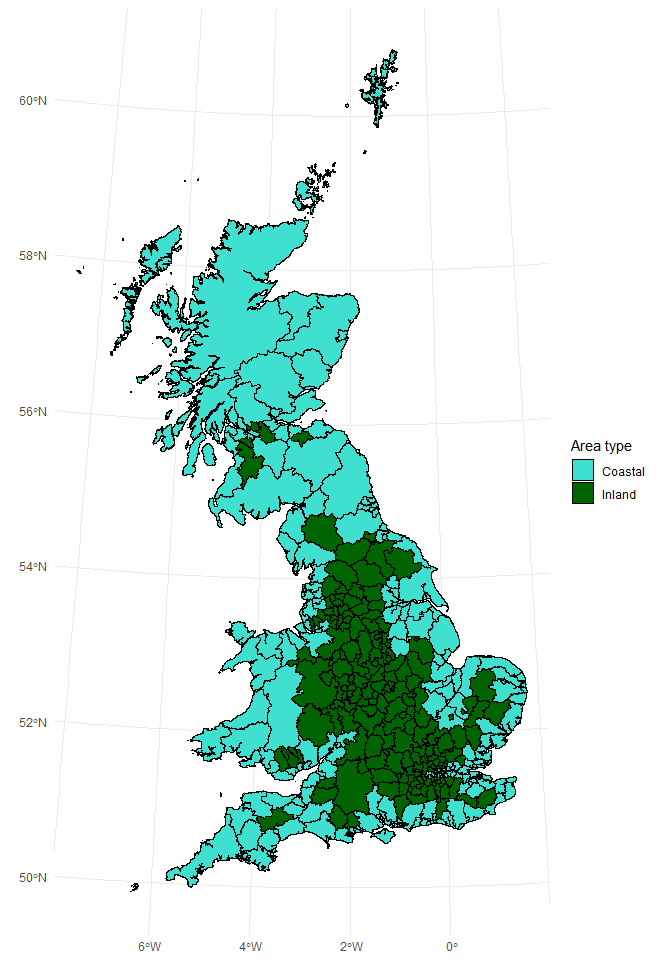

Code-along, Week 10: Modelling pubs, continued, continued
================
Alex Homer
25 November 2021

This week’s data come from the UK’s [Office for National
Statistics](https://www.ons.gov.uk/) (ONS). We will be using the
following datasets:

-   [Public houses and bars by local
    authority](https://www.ons.gov.uk/businessindustryandtrade/business/activitysizeandlocation/datasets/publichousesandbarsbylocalauthority)
    (Copyright date: 2018)
-   [Estimates of the population for the UK, England and Wales, Scotland
    and Northern
    Ireland](https://www.ons.gov.uk/peoplepopulationandcommunity/populationandmigration/populationestimates/datasets/populationestimatesforukenglandandwalesscotlandandnorthernireland)
    (Copyright date: 2021)
-   [Earnings and hours worked, place of residence by local authority:
    ASHE Table
    8](https://www.ons.gov.uk/employmentandlabourmarket/peopleinwork/earningsandworkinghours/datasets/placeofresidencebylocalauthorityashetable8)
    (Copyright date: 2021)
-   [Standard Area Measurements (2018) for Administrative Areas in the
    United
    Kingdom](https://geoportal.statistics.gov.uk/datasets/standard-area-measurements-2018-for-administrative-areas-in-the-united-kingdom/about)
    (Copyright date: 2019)
-   [Life Expectancy by Local
    Authority](https://www.ons.gov.uk/datasets/life-expectancy-by-local-authority/editions/time-series/versions/1)
    (Copyright date: 2020)
-   [Local Authority Districts (December 2018) Boundaries UK
    BFC](https://geoportal.statistics.gov.uk/maps/fef73aeaf13c417dadf2fc99abcf8eef/about)
    (Copyright date: 2019)

The data are subject to crown copyright and database rights and are used
under the [Open Government Licence
v3.0](https://www.nationalarchives.gov.uk/doc/open-government-licence/version/3/).
In addition the boundary file contains OS data © Crown copyright and
database right 2019.

``` r
library(tidyverse)
library(tidymodels)
library(sf)
library(here)
```

## Read data

I’ve already done some of the cleanup and joining in advance to save
time in the live session. You can see the cleanup script in the “data”
folder of this repo.

``` r
pubs_data <- readRDS(here("data/pubs-final.rds"))
```

Because I put these data together, let’s write a data dictionary:

-   `area_code`: the [ONS area
    code](https://en.wikipedia.org/wiki/ONS_coding_system) for each
    district
-   `area_name`: the name of each district
-   `num_pubs`: the number of pubs in each district (2018)
-   `pop`: the population of each district (2018)
-   `pubs_per_capita`: the number of pubs per person (2018; obtained by
    dividing `num_pubs` by `pop`)
-   `country`: which UK nation each district belongs to (England,
    Northern Ireland, Scotland or Wales)
-   `median_pay_2017`: the median weekly pay, in pounds sterling, for
    residents of each district (2017)
-   `area_sqkm`: the area, in square kilometres, of each district to
    mean high water level
-   `coastal`: categorical variable, with three values:
    -   `"Inland"`, for districts in Great Britain whose total extent is
        equal to their extent to mean high water level
    -   `"Coastal"`, for districts in Great Britain whose total extent
        is greater than their extent to mean high water level
    -   `NA`, for districts in Northern Ireland (the data in NI appear
        to have been measured differently, so all districts have equal
        values for their total extent and extent to mean high water)
-   `pop_dens`: the population density (people per square kilometre) of
    each district (2018; obtained by dividing `pop` by `area_sqkm`)
-   `life_exp_female`, `life_exp_male`: the life expectancy at birth of
    people born in each district, broken down by binary sex (2016–2018)
    [1]

It’s worth noting that the `coastal` variable doesn’t necessarily agree
with intuitive definitions of the words “coastal” and “inland”, because
of the effect of tidal rivers on the data…

``` r
shape_data <- read_sf(
  here(
    "data/map/Local_Authority_Districts_(December_2018)_Boundaries_UK_BFC.shp"
  )
)

shape_data %>%
  rename(area_code = lad18cd) %>%
  left_join(pubs_data, by = "area_code") %>%
  # Filter for Scotland so it knits on RStudio Cloud; remove this next line if
  # you want to make the whole map and you can get the code to run!
  filter(str_detect(area_code, "^S")) %>%
  ggplot(aes(fill = coastal)) +
  geom_sf(colour = "black") +
  scale_fill_manual(values = c(Coastal = "turquoise", Inland = "darkGreen")) +
  labs(fill = "Area type") +
  theme_minimal()
```

<!-- -->

By this definition, Glasgow is coastal, but Glaswegians might disagree
with that!

## Exploratory data analysis

### Missing data

Let’s have a look at the variables we have.

``` r
glimpse(pubs_data)
```

    ## Rows: 391
    ## Columns: 12
    ## $ area_code       <chr> "E06000047", "E06000005", "E06000001", "E06000002", "E…
    ## $ area_name       <chr> "County Durham", "Darlington", "Hartlepool", "Middlesb…
    ## $ num_pubs        <dbl> 325, 70, 50, 65, 245, 85, 110, 120, 195, 105, 100, 145…
    ## $ pop             <dbl> 526980, 106566, 93242, 140545, 320274, 136718, 197213,…
    ## $ pubs_per_capita <dbl> 0.0006167217, 0.0006568699, 0.0005362390, 0.0004624853…
    ## $ country         <chr> "England", "England", "England", "England", "England",…
    ## $ median_pay_2017 <dbl> 439.0, 416.2, 431.6, 364.3, 413.2, 387.6, 435.7, 405.5…
    ## $ area_sqkm       <dbl> 2231.5422, 197.4758, 93.5595, 53.8888, 5026.2114, 244.…
    ## $ coastal         <chr> "Coastal", "Inland", "Coastal", "Coastal", "Coastal", …
    ## $ pop_dens        <dbl> 236.15059, 539.64081, 996.60644, 2608.05585, 63.72076,…
    ## $ life_exp_female <dbl> 81.46, 82.39, 81.33, 80.02, 82.71, 81.78, 81.41, 81.43…
    ## $ life_exp_male   <dbl> 78.24, 78.72, 76.82, 75.27, 79.40, 77.99, 78.14, 77.46…

It would be good to see where our missing data are. For this, there are
two functions you haven’t necessarily seen before: `across` and
`select_if`. `across` lets you apply a function to multiple columns, and
`select_if` lets you select columns that satisfy a certain condition.

In both cases we use R’s tilde (`~`) and dot (`.`) notation to specify
the function we want to apply (we can think of a logical condition as a
special kind of function that outputs the values `TRUE` or `FALSE`).

``` r
cols_with_NAs <- pubs_data %>%
  summarise(across(everything(), ~sum(is.na(.)), .names = "NAs_{.col}")) %>%
  select_if(~ sum(.) > 0)

cols_with_NAs
```

    ## # A tibble: 1 × 4
    ##   NAs_median_pay_2017 NAs_coastal NAs_life_exp_female NAs_life_exp_male
    ##                 <int>       <int>               <int>             <int>
    ## 1                  13          11                  20                20

We’d like to see which areas have `NA`s against them. Since we’ll be
applying the same operations repeatedly, we can write a function for
this, whose argument will be a column name.

``` r
which_nas <- function(var_name) {
  pubs_data %>%
    filter(is.na((!!as.symbol(var_name)))) %>%
    pull(area_name)
}

col_choices <- cols_with_NAs %>%
  colnames() %>%
  str_remove("NAs_")

NA_places <- map(col_choices, which_nas) %>%
  set_names(col_choices)

NA_places
```

    ## $median_pay_2017
    ##  [1] "City of London"                      
    ##  [2] "Isles of Scilly"                     
    ##  [3] "Antrim and Newtownabbey"             
    ##  [4] "Ards and North Down"                 
    ##  [5] "Armagh City, Banbridge and Craigavon"
    ##  [6] "Belfast"                             
    ##  [7] "Causeway Coast and Glens"            
    ##  [8] "Derry City and Strabane"             
    ##  [9] "Fermanagh and Omagh"                 
    ## [10] "Lisburn and Castlereagh"             
    ## [11] "Mid and East Antrim"                 
    ## [12] "Mid Ulster"                          
    ## [13] "Newry, Mourne and Down"              
    ## 
    ## $coastal
    ##  [1] "Antrim and Newtownabbey"             
    ##  [2] "Ards and North Down"                 
    ##  [3] "Armagh City, Banbridge and Craigavon"
    ##  [4] "Belfast"                             
    ##  [5] "Causeway Coast and Glens"            
    ##  [6] "Derry City and Strabane"             
    ##  [7] "Fermanagh and Omagh"                 
    ##  [8] "Lisburn and Castlereagh"             
    ##  [9] "Mid and East Antrim"                 
    ## [10] "Mid Ulster"                          
    ## [11] "Newry, Mourne and Down"              
    ## 
    ## $life_exp_female
    ##  [1] "Forest Heath"          "St Edmundsbury"        "Suffolk Coastal"      
    ##  [4] "Waveney"               "City of London"        "Aylesbury Vale"       
    ##  [7] "Chiltern"              "South Bucks"           "Wycombe"              
    ## [10] "Bournemouth"           "Isles of Scilly"       "Poole"                
    ## [13] "Christchurch"          "East Dorset"           "North Dorset"         
    ## [16] "Purbeck"               "West Dorset"           "Weymouth and Portland"
    ## [19] "Taunton Deane"         "West Somerset"        
    ## 
    ## $life_exp_male
    ##  [1] "Forest Heath"          "St Edmundsbury"        "Suffolk Coastal"      
    ##  [4] "Waveney"               "City of London"        "Aylesbury Vale"       
    ##  [7] "Chiltern"              "South Bucks"           "Wycombe"              
    ## [10] "Bournemouth"           "Isles of Scilly"       "Poole"                
    ## [13] "Christchurch"          "East Dorset"           "North Dorset"         
    ## [16] "Purbeck"               "West Dorset"           "Weymouth and Portland"
    ## [19] "Taunton Deane"         "West Somerset"

What we get here is a named list, where each element of the list is a
vector of places that have the value `NA` in one of the columns, and the
name of each list element is the name of a column some of whose elements
are `NA`.

We can see here that:

-   The median pay is unavailable for the City of London and the Isles
    of Scilly—unsurprising, as these are very small areas in terms of
    population—and for the eleven Northern Irish local authorities,
    presumably because this element of data collection is devolved to
    the Northern Ireland Executive.
-   The eleven NI areas are also those where the coastal/inland data is
    unavailable, as referenced in the data dictionary.
-   The life expectancy data is unavailable for the City of London and
    the Isles of Scilly, again, and also for various English local
    authority areas that have been abolished since 2018. This is because
    the data, while applying to 2016–18, have been calculated for the
    current council areas and not for the ones that existed at the time.

### Pairs plot

A quick way to explore multiple variables at once is to do a pairs plot,
which is provided by the `ggpairs` function from the `GGally` package.

``` r
pubs_data %>%
  select(-c(area_code, area_name, coastal, num_pubs, pop)) %>%
  GGally::ggpairs(aes(colour = country))
```

<!-- -->

It’s a bit of a messy plot, and I’ve had to use both `message = FALSE`
and `warning = FALSE` in the chunk options above to avoid printing a
load of junk to the output. I’ve advised in the past that putting
`message = FALSE` is generally fine, but usually when you’re tempted to
use `warning = FALSE` you should instead fix whatever is causing the
warning to be displayed. So why am I going against my own advice?

The reason is that this is a plot that’s more useful for your own
explorations than for you to present to others; you would probably want
to select some of the plots to present, since it’s hrd to tell a
coherent story with this on its own. Meanwhile it would take quite a
while to fix a lot of the issues, and that probably isn’t worth it for a
plot just for yourself.

We’re particularly interested in the first column, showing relationships
between `pubs_per_capita`, our intended response variable, and the other
variables. But it’s hard to see because there are two outliers that
squash most of the points into the extreme left of the plot; they don’t
show up everywhere because of missing data. We can work out which these
are and remove them.

💡 *Before reading the output of the code below, can you work out which
two places they must be, given that they don’t appear in the plots for
median pay and for life expectancy?* 💡

``` r
pubs_data %>%
  slice_max(pubs_per_capita, n = 2) %>%
  select(area_name, num_pubs, pop, pubs_per_capita)
```

    ## # A tibble: 2 × 4
    ##   area_name       num_pubs   pop pubs_per_capita
    ##   <chr>              <dbl> <dbl>           <dbl>
    ## 1 City of London       160  8706         0.0184 
    ## 2 Isles of Scilly       10  2242         0.00446

It’s our old friends, the City of London and the Isles of Scilly. These
areas have particularly low populations, which force the number of pubs
per capita upwards. In addition, the City of London has a large
non-resident population—over half a million people work there [2],
compared to the nine thousand or so who live there—who presumably
frequent its pubs. Meanwhile, the Isles of Scilly consist of a number of
[separate islands without bridges between
them](https://www.visitislesofscilly.com/explore/island-hopping), that
are also separated from the mainland. So I think it’s fair to say that
these two observations are sufficiently distinct from the others that we
can remove them as outliers.

💡 *Why did I need to justify removing the outliers? What stopped me from
just removing them?* 💡

Let’s create a slightly-reduced dataset without these two points, and
repeat the `ggpairs` plot.

``` r
pubs_reduced <- pubs_data %>%
  filter(!(area_name %in% c("City of London", "Isles of Scilly")))
```

💡 *I could have done this by filtering for a pubs-per-capita figure that
was higher than 0.004. Why didn’t I?* 💡

``` r
pubs_reduced %>%
  select(-c(area_code, area_name, coastal, num_pubs, pop)) %>%
  GGally::ggpairs(aes(colour = country))
```

<!-- -->

That’s better!

💡 *One Scottish observation seems to have a very high area: that’s the
Highland council area in Scotland. Can we remove that as an outlier
too?* 💡

## Modelling

### Univariate regression

It looks like there’s a negative vaguely-linear trend on the graph of
pubs per capita vs pay. Let’s model that.

``` r
pubs_reduced <- pubs_data %>%
  filter(!(area_name %in% c("City of London", "Isles of Scilly")))

mod <- linear_reg() %>%
  set_engine("lm") %>%
  fit(pubs_per_capita ~ median_pay_2017, data = pubs_reduced)

tidy(mod)
```

    ## # A tibble: 2 × 5
    ##   term                estimate   std.error statistic  p.value
    ##   <chr>                  <dbl>       <dbl>     <dbl>    <dbl>
    ## 1 (Intercept)      0.00100     0.0000909       11.0  1.15e-24
    ## 2 median_pay_2017 -0.000000823 0.000000199     -4.13 4.48e- 5

We can interpret this as saying that:

-   for a district with a median pay of £0 per week, the predicted
    number of pubs per capita is 0.001, or one pub per thousand people.
-   for every pound per week that median pay increases, the predicted
    number of pubs per capita *decreases* by -0.000000823.

That last number isn’t very human readable. Let’s consider instead the
number of pubs per 10,000 people. Let’s also consider what happens when
pay increases by £100 per week. This has the combined effect of
multiplying the number by 10 000 × 100 = 1 000 000. So we have that

-   for every £100 per week that median pay increases, the predicted
    number of pubs per capita *decreases* by -0.823.

💡 *Is the intercept meaningful here? Note that, since pay can’t be
negative, a district with median pay of £0 per week must have more than
half of its population earning £0 per week.* 💡

``` r
glance(mod)
```

    ## # A tibble: 1 × 12
    ##   r.squared adj.r.squared    sigma statistic  p.value    df logLik    AIC    BIC
    ##       <dbl>         <dbl>    <dbl>     <dbl>    <dbl> <dbl>  <dbl>  <dbl>  <dbl>
    ## 1    0.0434        0.0408 0.000260      17.1  4.48e-5     1  2585. -5164. -5152.
    ## # … with 3 more variables: deviance <dbl>, df.residual <int>, nobs <int>

The *R*<sup>2</sup> isn’t amazing here. Perhaps we can improve the model
fit by considering more terms?

### Adding a categorical predictor

This document will be completed during the live session.

[1] Sex and gender are, of course, more complicated than that, but the
ONS only gives “male” and “female” figures; in the UK all birth
certificates have one of these two options recorded.

[2] Source: [City of London
website](https://www.cityoflondon.gov.uk/supporting-businesses/economic-research/statistics-about-the-city)
